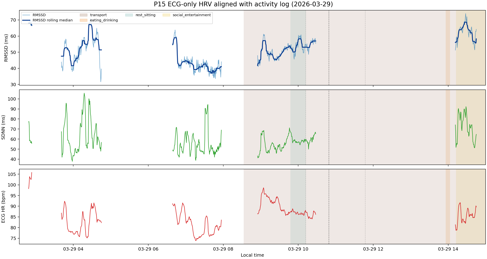

# P15 ECG-only HRV 与活动日志对齐案例分析（2026-03-29）

## 目的

使用 raw Polar ECG 单独计算 5 分钟 HRV 时间序列，再把 raw activity log 作为 sidecar annotation 对齐到每个窗口。本版本只要求 ECG label QC 通过，不要求 Earring/Ring/Watch 三设备 raw boundary aligned，也不要求 PPG sample coverage。

## 输入数据

- HRV 来源：`Multisite-PPG/raw_data` 中的 raw Polar ECG
- 活动日志来源：`Multisite-PPG/raw_data/P15/P15_activity_log.txt`
- 窗口设置：5 min window，stride 30 s
- ECG 保留条件：`ecg_label_qc_pass == True`

## 输出文件

- window-level sidecar CSV：`P15_2026-03-29_activity_hrv_ecg_only_stride30_window_aligned.csv`
- 可视化图：`P15_2026-03-29_activity_hrv_ecg_only_stride30_plot.png`

## 数据质量

- 当天 ECG-only 候选窗口数：1765
- ECG-QC 合格窗口数：556 (31.5%)
- ECG-QC 不合格窗口数：1209
- ECG-QC 合格窗口中心时间范围：2026-03-29 02:48:29 到 2026-03-29 14:44:59
- 当天解析出的 activity interval 数：6
- HRV 覆盖时间内的 point/unpaired activity event 数：5
- 未匹配到 activity 的窗口比例：54.0%

这个 ECG-only 版本用于回答全天 ECG-derived HRV 与 activity log 的关系；它不适合直接作为 PPG model training dataset，因为没有要求三设备 PPG 同时可用。

## 单日 HRV 波动范围

- RMSSD 中位数/IQR：51.16 ms / 13.24 ms
- RMSSD 最小值/最大值：31.63 ms / 73.95 ms
- 相邻窗口之间最大的 RMSSD 变化：14.50 ms
- 约 30 分钟内最大的 RMSSD 变化：31.92 ms
- SDNN 中位数/IQR：56.65 ms / 15.17 ms
- ECG HR 中位数/IQR：85.69 bpm / 7.84 bpm

## 按活动类别汇总

| 活动类别 | 窗口数 | 重叠分钟数 | RMSSD中位数_ms | RMSSD_IQR_ms | SDNN中位数_ms | 心率中位数_bpm | motion中位数 |
| --- | --- | --- | --- | --- | --- | --- | --- |
| transport | 156 | 780.00 | 51.71 | 6.79 | 55.41 | 88.06 |  |
| social_entertainment | 60 | 300.00 | 63.74 | 4.41 | 73.96 | 85.74 |  |
| rest_sitting | 40 | 200.00 | 53.09 | 7.33 | 57.45 | 86.52 |  |

## 活动粗分类与具体事件对应表

下表列出 ECG-only HRV 覆盖时间范围内，脚本解析到的每个粗分类及其对应的原始 activity 文本。

| 粗分类 | 类型 | 具体事件原始文本 | 出现次数 | 覆盖分钟数 | 示例时间 |
| --- | --- | --- | --- | --- | --- |
| eating_drinking | interval | start eating two boiled eggs warm -> end eating | 1 | 6.8 | 2026-03-29 13:56:07 -> 2026-03-29 14:02:53 |
| other | point/unpaired | I have a bad headache, it started when I woke up around 8am but I wasn't wearing the devices then | 1 |  | 2026-03-29 10:12:04 |
| other | point/unpaired | I was tidying up the house for the last 30min | 1 |  | 2026-03-29 10:48:46 |
| other | point/unpaired | I'm feeling anxious and have leg pain | 1 |  | 2026-03-29 10:49:28 |
| other | point/unpaired | headache feels a bit better now | 1 |  | 2026-03-29 10:48:56 |
| rest_sitting | interval | start playing with my dogs -> end playing with the dogs | 1 | 24.9 | 2026-03-29 09:47:26 -> 2026-03-29 10:12:21 |
| rest_sitting | point/unpaired | just been laying down on the couch scrolling for the last ~30 min. Leg pain feels a bit better | 1 |  | 2026-03-29 11:47:14 |
| social_entertainment | interval | start watching tv -> end watching tv | 1 | 35.1 | 2026-03-29 14:12:21 -> 2026-03-29 14:59:39 |
| transport | interval | Start driving | 1 | 374.7 | 2026-03-29 08:32:49 -> 2026-03-29 15:42:38 |

## 未匹配 Activity 的窗口

| 开始中心时间 | 结束中心时间 | 窗口数 | 说明 |
| --- | --- | --- | --- |
| 2026-03-29 02:48:29 | 2026-03-29 07:56:59 | 300 | 该时间段没有可靠 activity interval 与 HRV window 重叠 |

## Point/Unpaired Activity Events

| 时间 | 类型 | 类别 | 原始文本 | 主要原因 |
| --- | --- | --- | --- | --- |
| 2026-03-29 10:12:04 | point | other | I have a bad headache, it started when I woke up around 8am but I wasn't wearing the devices then | 单点状态/感受记录，不是明确 start-stop 活动区间 |
| 2026-03-29 10:48:46 | point | other | I was tidying up the house for the last 30min | 单点状态/感受记录，不是明确 start-stop 活动区间 |
| 2026-03-29 10:48:56 | point | other | headache feels a bit better now | 单点状态/感受记录，不是明确 start-stop 活动区间 |
| 2026-03-29 10:49:28 | point | other | I'm feeling anxious and have leg pain | 单点状态/感受记录，不是明确 start-stop 活动区间 |
| 2026-03-29 11:47:14 | point | rest_sitting | just been laying down on the couch scrolling for the last ~30 min. Leg pain feels a bit better | 单点状态/感受记录，不是明确 start-stop 活动区间 |

## 图像

图中相邻 HRV 点间隔超过 5 分钟时会自动断线，避免把缺失数据误画成长直线。

断线主要来自相邻 ECG-QC 合格窗口间隔过大，常见原因包括 raw ECG sample 不完整、R peak/IBI 质量不足，或 HRV 计算未通过 QC。

## 解读注意事项

- 这个版本只回答 ECG-derived HRV 的日内变化和 activity log 的对应关系。
- 与 raw-aligned training dataset 相比，它不会因为 Earring/Ring/Watch PPG 边界不齐而丢掉 ECG 可用窗口。
- activity category 来自自由文本规则归类，适合探索候选关系，不作为因果检验。
