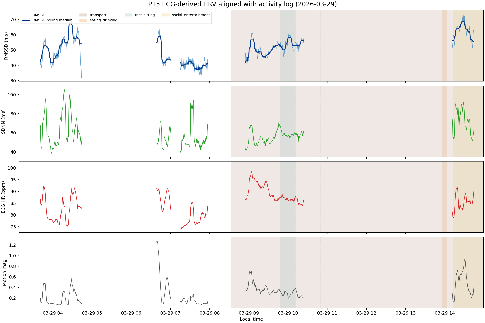

# P15 ECG-HRV 与活动日志对齐案例分析（2026-03-29）

## 目的

使用 stride30 数据集中的 ECG-derived HRV 作为 reference 时间序列，再把 raw activity log 作为 sidecar annotation 对齐到每个窗口。本分析用于探索单日 HRV 波动和活动记录之间的对应关系，不作为因果检验。

## 输入数据

- HRV 来源：`training_v1_stride30` NPZ
- 活动日志来源：`Multisite-PPG/raw_data/P15/P15_activity_log.txt`
- 窗口设置：5 min window，stride 30 s
- 活动对齐方式：计算每个 HRV 窗口 `[t0_ms, t1_ms]` 与解析出的 activity interval 的时间重叠

## 输出文件

- window-level sidecar CSV：`P15_2026-03-29_activity_hrv_stride30_window_aligned.csv`
- 可视化图：`P15_2026-03-29_activity_hrv_stride30_plot.png`

## 数据质量

- 当天 HRV 窗口数：508
- HRV 窗口中心时间范围：2026-03-29 03:23:29 到 2026-03-29 14:44:29
- 用于汇总的 ECG-QC 合格窗口数：508
- 当天解析出的 activity interval 数：6
- HRV 覆盖时间内的 point/unpaired activity event 数：5
- 未匹配到 activity 的窗口比例：51.4%

这里的 ECG-QC 合格定义为：`ecg_label_qc_pass == True`、`ecg_valid_ibi_ratio >= 1.0`、且 `ecg_ibi_correction_ratio <= 0.2`。

未匹配 activity 的窗口主要表示：这些 HRV window 没有和任何可解析出的 activity interval 发生时间重叠。它不是 ECG-QC 或 motion 筛选造成的；本 case study 没有用 motion threshold 筛窗口。

## 单日 HRV 波动范围

- RMSSD 中位数/IQR：51.26 ms / 12.87 ms
- RMSSD 最小值/最大值：31.63 ms / 73.95 ms
- 相邻窗口之间最大的 RMSSD 变化：20.34 ms
- 约 30 分钟内最大的 RMSSD 变化：31.92 ms
- SDNN 中位数/IQR：56.29 ms / 15.90 ms
- ECG HR 中位数/IQR：85.85 bpm / 8.00 bpm

## 按活动类别汇总

| 活动类别 | 窗口数 | 重叠分钟数 | RMSSD中位数_ms | RMSSD_IQR_ms | SDNN中位数_ms | 心率中位数_bpm | motion中位数 |
| --- | --- | --- | --- | --- | --- | --- | --- |
| transport | 148 | 740.00 | 51.25 | 6.50 | 55.09 | 88.16 | 0.34 |
| social_entertainment | 59 | 295.00 | 63.69 | 4.54 | 74.10 | 85.73 | 0.56 |
| rest_sitting | 40 | 200.00 | 53.09 | 7.33 | 57.45 | 86.52 | 0.29 |

## 活动粗分类与具体事件对应表

下表列出 HRV 覆盖时间范围内，脚本解析到的每个粗分类及其对应的原始 activity 文本。`interval` 表示可配对成 start-stop 时间段的事件，`point/unpaired` 表示只有单点记录或没有稳定配对的事件。

| 粗分类 | 类型 | 具体事件原始文本 | 出现次数 | 覆盖分钟数 | 示例时间 |
| --- | --- | --- | --- | --- | --- |
| eating_drinking | interval | start eating two boiled eggs warm -> end eating | 1 | 6.8 | 2026-03-29 13:56:07 -> 2026-03-29 14:02:53 |
| other | point/unpaired | I have a bad headache, it started when I woke up around 8am but I wasn't wearing the devices then | 1 |  | 2026-03-29 10:12:04 |
| other | point/unpaired | I was tidying up the house for the last 30min | 1 |  | 2026-03-29 10:48:46 |
| other | point/unpaired | I'm feeling anxious and have leg pain | 1 |  | 2026-03-29 10:49:28 |
| other | point/unpaired | headache feels a bit better now | 1 |  | 2026-03-29 10:48:56 |
| rest_sitting | interval | start playing with my dogs -> end playing with the dogs | 1 | 24.9 | 2026-03-29 09:47:26 -> 2026-03-29 10:12:21 |
| rest_sitting | point/unpaired | just been laying down on the couch scrolling for the last ~30 min. Leg pain feels a bit better | 1 |  | 2026-03-29 11:47:14 |
| social_entertainment | interval | start watching tv -> end watching tv | 1 | 34.6 | 2026-03-29 14:12:21 -> 2026-03-29 14:59:39 |
| transport | interval | Start driving | 1 | 374.2 | 2026-03-29 08:32:49 -> 2026-03-29 15:42:38 |

## 未匹配 Activity 的窗口

下面列出连续的 `unlabeled` 区间。原因通常是原始 activity log 在对应时间没有可靠 start-stop 区间，或者只有单点记录，脚本没有强行延长成活动段。

| 开始中心时间 | 结束中心时间 | 窗口数 | 说明 |
| --- | --- | --- | --- |
| 2026-03-29 03:23:29 | 2026-03-29 07:56:59 | 261 | 该时间段没有可靠 activity interval 与 HRV window 重叠 |

## Point/Unpaired Activity Events

这些事件来自原始 activity log，但没有被配成完整 activity interval。常见原因包括重复 stop、拼写错误导致类别无法稳定配对、或本身只是单点状态记录。

| 时间 | 类型 | 类别 | 原始文本 | 主要原因 |
| --- | --- | --- | --- | --- |
| 2026-03-29 10:12:04 | point | other | I have a bad headache, it started when I woke up around 8am but I wasn't wearing the devices then | 单点状态/感受记录，不是明确 start-stop 活动区间 |
| 2026-03-29 10:48:46 | point | other | I was tidying up the house for the last 30min | 单点状态/感受记录，不是明确 start-stop 活动区间 |
| 2026-03-29 10:48:56 | point | other | headache feels a bit better now | 单点状态/感受记录，不是明确 start-stop 活动区间 |
| 2026-03-29 10:49:28 | point | other | I'm feeling anxious and have leg pain | 单点状态/感受记录，不是明确 start-stop 活动区间 |
| 2026-03-29 11:47:14 | point | rest_sitting | just been laying down on the couch scrolling for the last ~30 min. Leg pain feels a bit better | 单点状态/感受记录，不是明确 start-stop 活动区间 |

## 图像

下图把 ECG-derived RMSSD、SDNN、ECG HR 和 motion magnitude 画在同一时间轴上，并用背景色标出解析出的 activity interval。灰色虚线表示 point/unpaired event。

图中相邻 HRV 点间隔超过 5 分钟时会自动断线，避免把缺失数据误画成长直线。

断线主要来自相邻可用窗口间隔过大，常见原因包括 ECG-QC 未通过、共同窗口数据缺失，或三设备边界/sample coverage 不满足要求。

需要注意的是，图像只显示 HRV 有可用 window 的时间范围；如果原始 activity log 晚上还有记录但 training stride30 HRV 数据在那些时段没有可用窗口，晚上 activity log 不会显示在图中。这样做是为了避免把没有 HRV 数据的 activity 区间误读成可分析区间。

## 解读注意事项

- activity log 是人工输入的自由文本，因此 activity category 只是近似归类。
- 每个 5 分钟 HRV 窗口的 `activity_category` 由时间重叠最多的 activity interval 决定。
- 同一时间可能存在重叠活动；CSV 的 `activity_raw` 字段保留了原始重叠细节。
- 这张图适合用来发现 HRV 与 activity 的候选对应关系；如果要做一般性结论，需要在更多 participant/day 上验证。
