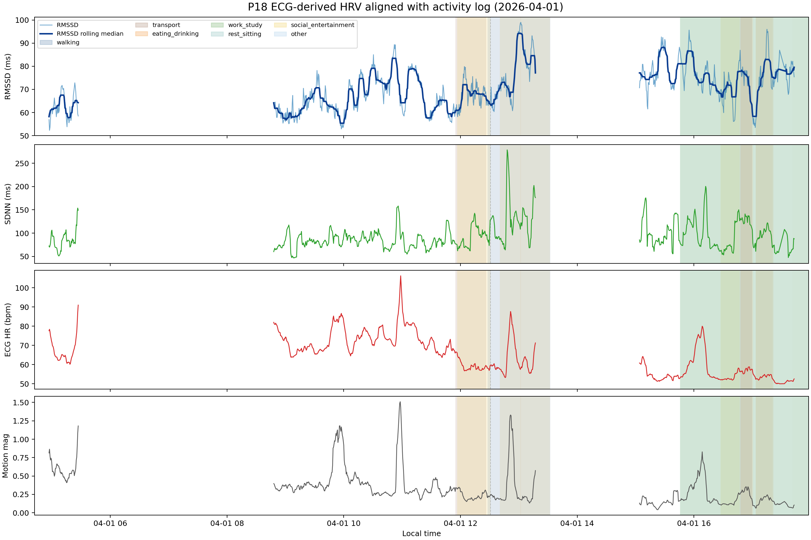

# P18 ECG-HRV 与活动日志对齐案例分析（2026-04-01）

## 目的

使用 stride30 数据集中的 ECG-derived HRV 作为 reference 时间序列，再把 raw activity log 作为 sidecar annotation 对齐到每个窗口。本分析用于探索单日 HRV 波动和活动记录之间的对应关系，不作为因果检验。

## 输入数据

- HRV 来源：`training_v1_stride30` NPZ
- 活动日志来源：`Multisite-PPG/raw_data/P18/P18_activity_log.txt`
- 窗口设置：5 min window，stride 30 s
- 活动对齐方式：计算每个 HRV 窗口 `[t0_ms, t1_ms]` 与解析出的 activity interval 的时间重叠

## 输出文件

- window-level sidecar CSV：`P18_2026-04-01_activity_hrv_stride30_window_aligned.csv`
- 可视化图：`P18_2026-04-01_activity_hrv_stride30_plot.png`

## 数据质量

- 当天 HRV 窗口数：905
- HRV 窗口中心时间范围：2026-04-01 04:57:00 到 2026-04-01 17:43:00
- 用于汇总的 ECG-QC 合格窗口数：905
- 当天解析出的 activity interval 数：41
- HRV 覆盖时间内的 point/unpaired activity event 数：1
- 未匹配到 activity 的窗口比例：56.0%

这里的 ECG-QC 合格定义为：`ecg_label_qc_pass == True`、`ecg_valid_ibi_ratio >= 1.0`、且 `ecg_ibi_correction_ratio <= 0.2`。

未匹配 activity 的窗口主要表示：这些 HRV window 没有和任何可解析出的 activity interval 发生时间重叠。它不是 ECG-QC 或 motion 筛选造成的；本 case study 没有用 motion threshold 筛窗口。

## 单日 HRV 波动范围

- RMSSD 中位数/IQR：70.32 ms / 13.84 ms
- RMSSD 最小值/最大值：52.29 ms / 98.97 ms
- 相邻窗口之间最大的 RMSSD 变化：17.63 ms
- 约 30 分钟内最大的 RMSSD 变化：35.94 ms
- SDNN 中位数/IQR：86.05 ms / 32.36 ms
- ECG HR 中位数/IQR：64.19 bpm / 16.70 bpm

## 按活动类别汇总

| 活动类别 | 窗口数 | 重叠分钟数 | RMSSD中位数_ms | RMSSD_IQR_ms | SDNN中位数_ms | 心率中位数_bpm | motion中位数 |
| --- | --- | --- | --- | --- | --- | --- | --- |
| social_entertainment | 108 | 539.44 | 73.77 | 15.03 | 111.12 | 58.09 | 0.19 |
| rest_sitting | 102 | 485.97 | 76.47 | 9.90 | 85.95 | 54.79 | 0.18 |
| transport | 64 | 294.95 | 67.05 | 7.93 | 84.39 | 58.86 | 0.21 |
| work_study | 57 | 285.00 | 73.96 | 13.39 | 81.28 | 52.46 | 0.12 |
| walking | 42 | 208.03 | 70.01 | 9.60 | 122.33 | 58.01 | 0.23 |
| eating_drinking | 25 | 125.00 | 80.06 | 8.76 | 104.78 | 54.08 | 0.20 |

## 活动粗分类与具体事件对应表

下表列出 HRV 覆盖时间范围内，脚本解析到的每个粗分类及其对应的原始 activity 文本。`interval` 表示可配对成 start-stop 时间段的事件，`point/unpaired` 表示只有单点记录或没有稳定配对的事件。

| 粗分类 | 类型 | 具体事件原始文本 | 出现次数 | 覆盖分钟数 | 示例时间 |
| --- | --- | --- | --- | --- | --- |
| eating_drinking | interval | start drinking water -> stop drinking water | 3 | 1.4 | 2026-04-01 13:01:34 -> 2026-04-01 13:01:57; 2026-04-01 17:00:17 -> 2026-04-01 17:00:48 |
| eating_drinking | interval | start eating Mac and cheese and stir fried vegetables -> stop eating | 1 | 17.6 | 2026-04-01 17:03:36 -> 2026-04-01 17:21:10 |
| eating_drinking | interval | start warming up lunch -> stop warming up food | 1 | 12.4 | 2026-04-01 16:47:43 -> 2026-04-01 17:00:05 |
| rest_sitting | interval | start sitting on couch -> stop sitting on couch | 2 | 106.8 | 2026-04-01 15:45:39 -> 2026-04-01 16:47:10; 2026-04-01 17:00:11 -> 2026-04-01 19:16:34 |
| social_entertainment | interval | start listening to music -> stop listening to mysic | 1 | 34.4 | 2026-04-01 11:56:35 -> 2026-04-01 12:30:58 |
| social_entertainment | interval | start talking on facetime -> stop talking on phone | 1 | 19.8 | 2026-04-01 16:27:18 -> 2026-04-01 16:47:03 |
| social_entertainment | interval | start watching youtube -> stop watching youtueb | 1 | 51.7 | 2026-04-01 12:40:24 -> 2026-04-01 13:32:06 |
| transport | interval | start driving -> stop driving | 1 | 31.8 | 2026-04-01 11:54:45 -> 2026-04-01 12:26:35 |
| transport | point/unpaired | stop driving | 1 |  | 2026-04-01 12:30:52 |
| walking | interval | start incline walk on treadmill -> stop incline walk | 1 | 61.9 | 2026-04-01 12:30:16 -> 2026-04-01 13:32:12 |
| walking | interval | start walking -> stop walking | 2 | 15.1 | 2026-04-01 12:27:37 -> 2026-04-01 12:30:05; 2026-04-01 16:47:14 -> 2026-04-01 16:59:53 |
| work_study | interval | start joining Zoom call on laptop -> stop zoom meeting | 1 | 37.8 | 2026-04-01 17:03:19 -> 2026-04-01 17:41:05 |
| work_study | interval | start working on laptop | 1 | 77.6 | 2026-04-01 15:45:46 -> 2026-04-01 17:03:19 |
| work_study | interval | start working on laptop -> stop working on laptop | 1 | 4.3 | 2026-04-01 17:41:12 -> 2026-04-01 19:16:48 |

## 未匹配 Activity 的窗口

下面列出连续的 `unlabeled` 区间。原因通常是原始 activity log 在对应时间没有可靠 start-stop 区间，或者只有单点记录，脚本没有强行延长成活动段。

| 开始中心时间 | 结束中心时间 | 窗口数 | 说明 |
| --- | --- | --- | --- |
| 2026-04-01 04:57:00 | 2026-04-01 11:52:00 | 427 | 该时间段没有可靠 activity interval 与 HRV window 重叠 |
| 2026-04-01 15:03:30 | 2026-04-01 15:43:00 | 80 | 该时间段没有可靠 activity interval 与 HRV window 重叠 |

## Point/Unpaired Activity Events

这些事件来自原始 activity log，但没有被配成完整 activity interval。常见原因包括重复 stop、拼写错误导致类别无法稳定配对、或本身只是单点状态记录。

| 时间 | 类型 | 类别 | 原始文本 | 主要原因 |
| --- | --- | --- | --- | --- |
| 2026-04-01 12:30:52 | stop | transport | stop driving | 只有 stop 或 stop 无法和同类别 start 稳定配对 |

## 图像

下图把 ECG-derived RMSSD、SDNN、ECG HR 和 motion magnitude 画在同一时间轴上，并用背景色标出解析出的 activity interval。灰色虚线表示 point/unpaired event。

图中相邻 HRV 点间隔超过 5 分钟时会自动断线，避免把缺失数据误画成长直线。

断线主要来自相邻可用窗口间隔过大，常见原因包括 ECG-QC 未通过、共同窗口数据缺失，或三设备边界/sample coverage 不满足要求。

需要注意的是，图像只显示 HRV 有可用 window 的时间范围；如果原始 activity log 晚上还有记录但 training stride30 HRV 数据在那些时段没有可用窗口，晚上 activity log 不会显示在图中。这样做是为了避免把没有 HRV 数据的 activity 区间误读成可分析区间。

## 解读注意事项

- activity log 是人工输入的自由文本，因此 activity category 只是近似归类。
- 每个 5 分钟 HRV 窗口的 `activity_category` 由时间重叠最多的 activity interval 决定。
- 同一时间可能存在重叠活动；CSV 的 `activity_raw` 字段保留了原始重叠细节。
- 这张图适合用来发现 HRV 与 activity 的候选对应关系；如果要做一般性结论，需要在更多 participant/day 上验证。
