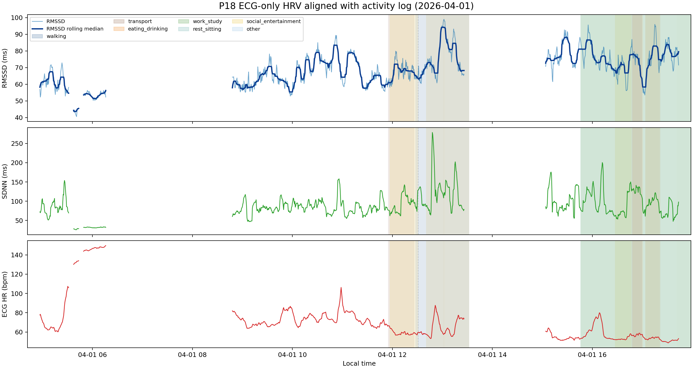
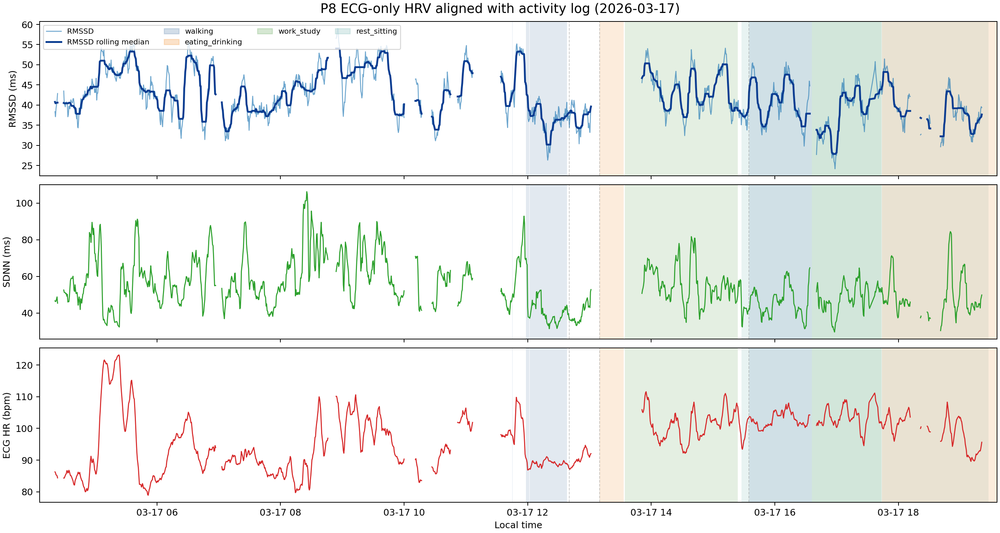
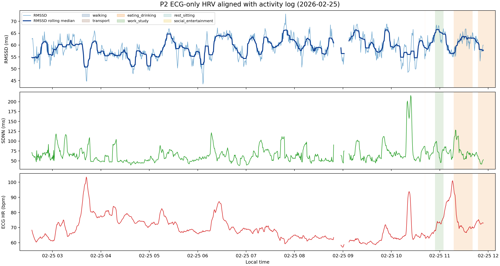
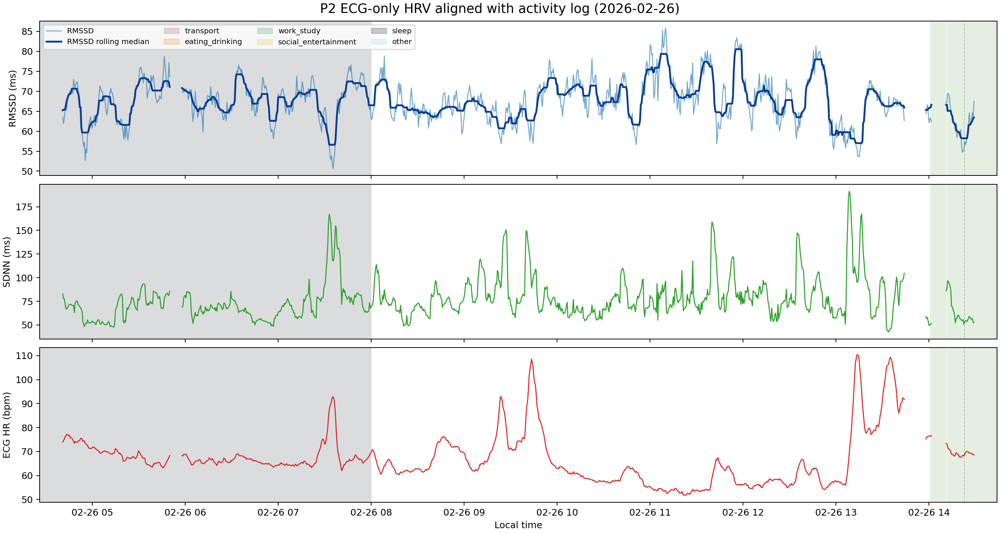
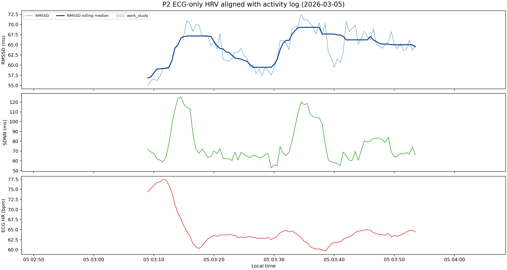

# P18、P8、P15、P2 ECG-derived HRV 与 Activity Log 结果总结

## 直接回答

### 日内波动幅度与速度

结合 P18、P8、P15 和新增 P2 多日 case study，ECG-derived HRV 在一天内有明显日内波动。以 RMSSD 为例，所有已分析日期的窗口值大约覆盖 **24.17-98.97 ms**；单个参与者单日 RMSSD 跨度约 **17.55-58.69 ms**，若排除 P2 2026-03-05 这种只有约 50 分钟 ECG-QC 合格窗口的短覆盖日，单日跨度约 **29.57-58.69 ms**。即使用 5 分钟窗口计算，HRV 也不是稳定不变的。

变化速度上，ECG-only 结果里相邻 stride30 窗口之间的最大 RMSSD 变化约 **8.69-17.86 ms**；在约 30 分钟尺度内，最大 RMSSD 变化约 **11.77-36.24 ms**。短覆盖日的变化幅度较小，但 P18、P8、P15 和 P2 的主要覆盖日期都说明 HRV 可以在几十分钟内出现明显变化。

### 与 Activity 的对应关系

最清楚的模式仍来自 P18：低强度活动，如 `rest_sitting`、`eating_drinking`、`work_study`、`social_entertainment`，通常对应较高 RMSSD 和较低 ECG HR；移动/交通相关活动，如 `transport` 和部分 `walking`，RMSSD 相对更低一些。

P8 的 HR 整体较高、RMSSD 整体较低，activity 类别之间分离不如 P18 明显。P15 显示 `social_entertainment` 的 RMSSD 明显高于 `transport`，但 P15 未匹配窗口和断线较多，因此更适合作为数据覆盖限制的例子。P2 提供了多日重复观察：睡眠/低负荷日的 RMSSD 较高，压力、运动或高负荷日的 HR 更高、RMSSD 相对更低，但 P2 的 activity log 也有大量未标注或粗粒度文本，所以适合作为“多日探索性模式”，不是因果证明。

总体结论是：**HRV 与 activity 状态有时间上的对应关系，尤其是低强度状态常对应较高 HRV/较低 HR，而交通、移动或较高身体负荷状态常对应较低 HRV或更高 HR。但这些结果应解释为探索性关联，不应写成因果证明。**

## 结果文件链接

| 参与者 | 日期 | 版本 | 测试结果 |
| --- | --- | --- | --- |
| P18 | 2026-04-01 | ECG-only stride30 | [P18_2026-04-01_activity_hrv_ecg_only_stride30_case_study.md](P18_2026-04-01_activity_hrv_ecg_only_stride30_case_study.md) |
| P8 | 2026-03-17 | ECG-only stride30 | [P8_2026-03-17_activity_hrv_ecg_only_stride30_case_study.md](P8_2026-03-17_activity_hrv_ecg_only_stride30_case_study.md) |
| P15 | 2026-03-29 | ECG-only stride30 | [P15_2026-03-29_activity_hrv_ecg_only_stride30_case_study.md](P15_2026-03-29_activity_hrv_ecg_only_stride30_case_study.md) |
| P2 | 2026-02-25 | ECG-only stride30 | [P2_2026-02-25_activity_hrv_ecg_only_stride30_case_study.md](P2_2026-02-25_activity_hrv_ecg_only_stride30_case_study.md) |
| P2 | 2026-02-26 | ECG-only stride30 | [P2_2026-02-26_activity_hrv_ecg_only_stride30_case_study.md](P2_2026-02-26_activity_hrv_ecg_only_stride30_case_study.md) |
| P2 | 2026-02-27 | ECG-only stride30 | [P2_2026-02-27_activity_hrv_ecg_only_stride30_case_study.md](P2_2026-02-27_activity_hrv_ecg_only_stride30_case_study.md) |
| P2 | 2026-02-28 | ECG-only stride30 | [P2_2026-02-28_activity_hrv_ecg_only_stride30_case_study.md](P2_2026-02-28_activity_hrv_ecg_only_stride30_case_study.md) |
| P2 | 2026-03-05 | ECG-only stride30 | [P2_2026-03-05_activity_hrv_ecg_only_stride30_case_study.md](P2_2026-03-05_activity_hrv_ecg_only_stride30_case_study.md) |

P2 的 raw ECG 覆盖 2026-02-25 到 2026-03-05；其中 2026-03-01、2026-03-02、2026-03-03、2026-03-04 没有 ECG-QC 合格窗口，因此没有生成有效 HRV 曲线。

## 单日 HRV 波动幅度

下表只保留 ECG-only stride30 结果，用于回答“一个人的 ECG-derived HRV 当天如何变化”。共同窗口 stride30 数据集生成的结果已经从本目录删除。

| 参与者 | 版本 | RMSSD 中位数/IQR ms | RMSSD 最小-最大 ms | 单日 RMSSD 跨度 ms | 相邻窗口最大变化 ms | 约 30 分钟最大变化 ms | ECG HR 中位数/IQR bpm |
| --- | --- | --- | --- | --- | --- | --- | --- |
| P18 | ECG-only | 69.24 / 14.24 | 40.28-98.97 | 58.69 | 17.86 | 36.24 | 65.47 / 17.56 |
| P8 | ECG-only | 41.57 / 8.88 | 24.17-59.00 | 34.83 | 16.06 | 27.47 | 97.76 / 13.20 |
| P15 | ECG-only | 51.16 / 13.24 | 31.63-73.95 | 42.32 | 14.50 | 31.92 | 85.69 / 7.84 |
| P2 2026-02-25 | ECG-only | 59.34 / 6.02 | 43.54-73.11 | 29.57 | 9.09 | 18.55 | 68.16 / 9.91 |
| P2 2026-02-26 | ECG-only | 67.43 / 6.75 | 50.68-85.86 | 35.18 | 12.74 | 23.91 | 65.26 / 9.35 |
| P2 2026-02-27 | ECG-only | 59.40 / 5.67 | 39.02-72.49 | 33.47 | 11.08 | 21.82 | 73.53 / 11.09 |
| P2 2026-02-28 | ECG-only | 73.14 / 8.12 | 56.21-88.09 | 31.88 | 16.75 | 27.14 | 64.64 / 9.95 |
| P2 2026-03-05 | ECG-only | 64.86 / 6.40 | 55.01-72.56 | 17.55 | 8.69 | 11.77 | 63.57 / 1.75 |

## 按参与者解读

### P18：最适合作为主例子

P18 的 activity log 比较丰富，且 activity 类别之间的 HRV/HR 差异较容易解释。ECG-only 结果中，RMSSD 范围为 **40.28-98.97 ms**，单日跨度 **58.69 ms**；相邻窗口最大变化 **17.86 ms**，约 30 分钟内最大变化 **36.24 ms**。这说明 P18 一天内 HRV 波动明显，而且可以在几十分钟内快速变化。

P18 的 ECG-only activity 汇总中：

| 活动类别 | RMSSD 中位数 ms | SDNN 中位数 ms | ECG HR 中位数 bpm | 解释 |
| --- | --- | --- | --- | --- |
| eating_drinking | 80.87 | 104.78 | 54.01 | HR 较低、HRV 较高，符合低强度状态 |
| rest_sitting | 76.44 | 86.58 | 54.79 | HR 较低、HRV 较高 |
| work_study | 75.18 | 79.25 | 51.75 | 静态工作/电脑状态，HR 较低 |
| social_entertainment | 72.70 | 101.86 | 59.06 | 低强度娱乐/通话/听音乐 |
| walking | 70.01 | 122.33 | 58.01 | 移动相关，但 HR 未明显升高 |
| transport | 67.05 | 84.39 | 58.86 | RMSSD 相对更低 |

P18 的 ECG-only 结果支持：低强度活动下 HRV 较高、HR 较低；交通/移动相关活动下 HRV 相对更低。因此 P18 是这些例子中最适合用来回答 activity-HRV 对应关系的 participant。

### P8：HR 整体偏高、HRV 整体偏低

P8 的 RMSSD 整体低于 P18，ECG HR 整体明显更高。ECG-only 结果中，RMSSD 范围为 **24.17-59.00 ms**，单日跨度 **34.83 ms**；相邻窗口最大变化 **16.06 ms**，约 30 分钟内最大变化 **27.47 ms**。

P8 的 ECG-only activity 汇总中：

| 活动类别 | RMSSD 中位数 ms | SDNN 中位数 ms | ECG HR 中位数 bpm | 解释 |
| --- | --- | --- | --- | --- |
| work_study | 41.44 | 52.65 | 102.41 | HR 高、HRV 低 |
| walking | 38.67 | 42.86 | 99.41 | HR 仍较高 |
| rest_sitting | 38.53 | 45.59 | 100.49 | 即使休息/玩手机，HR 仍高 |

P8 说明不同个体之间 baseline 可以差很多。P8 的 activity 类别之间没有 P18 那么清楚的分离，但它支持另一个常识性现象：当 HR 整体偏高时，RMSSD 往往整体偏低。

### P15：有一定 activity 关联，但数据覆盖限制更明显

P15 的 RMSSD 范围和变化速度都比较明显，但未匹配窗口和断线较多，所以更适合作为补充例子。ECG-only 结果中，RMSSD 范围为 **31.63-73.95 ms**，单日跨度 **42.32 ms**；相邻窗口最大变化 **14.50 ms**，约 30 分钟内最大变化 **31.92 ms**。

P15 的 ECG-only activity 汇总中：

| 活动类别 | RMSSD 中位数 ms | SDNN 中位数 ms | ECG HR 中位数 bpm | 解释 |
| --- | --- | --- | --- | --- |
| social_entertainment | 63.74 | 73.96 | 85.74 | HRV 相对较高 |
| rest_sitting | 53.09 | 57.45 | 86.52 | 中间水平 |
| transport | 51.71 | 55.41 | 88.06 | RMSSD 较低、HR 较高 |

P15 也显示 `transport` 相比 `social_entertainment` 更低 HRV、更高 HR。但因为 activity log 在早晨覆盖不足，且有较多 point/unpaired 记录，所以不能把 P15 作为最强证据。

### P2：多日 ECG-only 轨迹，适合观察日间状态差异

P2 新增了 5 个可生成 ECG-only HRV 曲线的日期：2026-02-25、2026-02-26、2026-02-27、2026-02-28、2026-03-05。2026-03-01 到 2026-03-04 没有 ECG-QC 合格窗口，因此没有有效 HRV 曲线。P2 各天 ECG-QC 合格窗口比例为 **19.4-43.6%**，说明 P2 的 raw ECG 覆盖并不连续；解释 activity-HRV 关系时要看图中的断线和未标注比例。

P2 每天的 ECG-only RMSSD 范围如下：

| 日期 | ECG-QC 合格窗口数 | RMSSD 中位数/IQR ms | RMSSD 最小-最大 ms | 单日 RMSSD 跨度 ms | 约 30 分钟最大变化 ms | 未匹配 activity |
| --- | ---: | ---: | ---: | ---: | ---: | ---: |
| 2026-02-25 | 1071 | 59.34 / 6.02 | 43.54-73.11 | 29.57 | 18.55 | 89.1% |
| 2026-02-26 | 1102 | 67.43 / 6.75 | 50.68-85.86 | 35.18 | 23.91 | 61.2% |
| 2026-02-27 | 1252 | 59.40 / 5.67 | 39.02-72.49 | 33.47 | 21.82 | 0.0% |
| 2026-02-28 | 683 | 73.14 / 8.12 | 56.21-88.09 | 31.88 | 27.14 | 0.0% |
| 2026-03-05 | 90 | 64.86 / 6.40 | 55.01-72.56 | 17.55 | 11.77 | 100.0% |

P2 的 activity 汇总显示，多日合并后 `sleep` 和部分低负荷/未细分类的 `other` 窗口 RMSSD 较高，而 `exercise`、`symptom_fatigue`、`eating_drinking` 和部分 `work_study` 窗口的 RMSSD 相对更低、HR 更高。这里已按人工确认后的规则修正：`focus/coding frustration/discussion` 归为 `work_study`，`feeling very tired` 归为 `symptom_fatigue`，`grocery store/shopping` 归为 `walking`，`fixing bike` 归为 `exercise`，`listening to ...` 归为 `social_entertainment`。

| 活动类别 | 覆盖窗口数 | 覆盖天数 | RMSSD 中位数/IQR ms | SDNN 中位数 ms | ECG HR 中位数 bpm | 解读 |
| --- | ---: | ---: | ---: | ---: | ---: | --- |
| other | 253 | 1 | 72.06 / 12.20 | 87.29 | 69.29 | 主要来自 mock patient / trauma simulation 等尚未细分记录，类别较混杂 |
| sleep | 969 | 3 | 69.56 / 10.35 | 73.56 | 66.74 | 睡眠/低负荷状态下 HRV 较高、HR 较低 |
| stress | 21 | 1 | 63.84 / 3.12 | 74.14 | 75.51 | 明确 stress 点附近窗口，数量少但 HR 较高 |
| work_study | 369 | 3 | 61.24 / 5.07 | 63.88 | 74.55 | 包含 focus、coding、meeting、lecture、reading/test 等认知负荷 |
| eating_drinking | 132 | 2 | 60.74 / 4.43 | 70.54 | 73.37 | 比 sleep 更低 HRV、更高 HR |
| walking | 55 | 1 | 60.32 / 5.57 | 61.09 | 63.01 | 只来自单日，不能单独作为稳定结论 |
| symptom_fatigue | 20 | 1 | 59.37 / 2.76 | 54.34 | 81.15 | 疲劳/不适记录，窗口少但 HR 最高 |
| exercise | 652 | 1 | 58.86 / 6.07 | 62.76 | 69.99 | 运动相关窗口 RMSSD 偏低，主要集中在 2026-02-27 |
| personal_care | 9 | 1 | 58.63 / 5.02 | 75.06 | 78.00 | 换衣服等短时个人护理，窗口很少 |

P2 最有信息量的是 2026-02-27 和 2026-02-28：前者 activity log 覆盖完整，包含 exercise、work/study、stress、fatigue、eating、walking、sleep 等状态；后者睡眠窗口 RMSSD 中位数达到 **73.64 ms**，高于 P2 其他多数活动类别。整体上，P2 支持“睡眠/低负荷状态 HRV 较高，疲劳、认知负荷或运动相关状态 HRV 较低、HR 较高”的探索性模式。

## 综合结论

1. **HRV 日内变化幅度明显。**  
   ECG-only 结果中，P18、P8、P15 和 P2 的 RMSSD 单日跨度约 **17.55-58.69 ms**；如果排除 P2 2026-03-05 这种短覆盖日，跨度约 **29.57-58.69 ms**。这说明同一个人一天内 HRV 可以有很大变化。

2. **HRV 可以在几十分钟内快速变化。**  
   ECG-only 结果中，约 30 分钟内最大 RMSSD 变化为 **11.77-36.24 ms**；排除短覆盖日后为 **18.55-36.24 ms**。因此，HRV 不只是“天与天之间”变化，也会在一天内部随状态变化。

3. **活动关联最清楚的是 P18。**  
   P18 中休息、吃饭、工作/学习、社交娱乐等低强度活动对应较高 RMSSD 和较低 HR；交通/移动相关活动对应相对较低 RMSSD。

4. **P8、P15 和 P2 提供补充信息。**  
   P8 显示个体 baseline 差异很大：HR 整体高、RMSSD 整体低，各 activity 之间差异弱。P15 显示 `social_entertainment` 高于 `transport`，但数据覆盖限制明显。P2 提供多日重复观察，显示 sleep/低负荷日 RMSSD 较高，stress/exercise 相关窗口 RMSSD 相对更低、HR 更高。

5. **结论应写成探索性关联。**  
   activity log 是自由文本且覆盖不完整，部分 activity 只有单点或未配对记录；图中断线也说明并非所有时间都有连续可靠 HRV。因此这些结果支持“HRV 与 activity 状态存在时间对应关系”，但不能写成“某活动导致 HRV 改变”的因果结论。

## 可放入报告的一句话

基于 P18、P8、P15 和 P2 的 ECG-derived HRV 与 activity log 对齐分析，单个参与者的 RMSSD 在一天内可变化约 **18-59 ms**，排除短覆盖日后约 **30-59 ms**，在约 30 分钟内可变化约 **12-36 ms**；活动关联方面，低强度状态和 sleep 通常对应较高 HRV 和较低 HR，而交通、移动、压力或较高身体负荷状态通常对应较低 HRV 或较高 HR，但由于 activity log 覆盖不完整且为自由文本记录，该结论应视为探索性关联而非因果证明。
