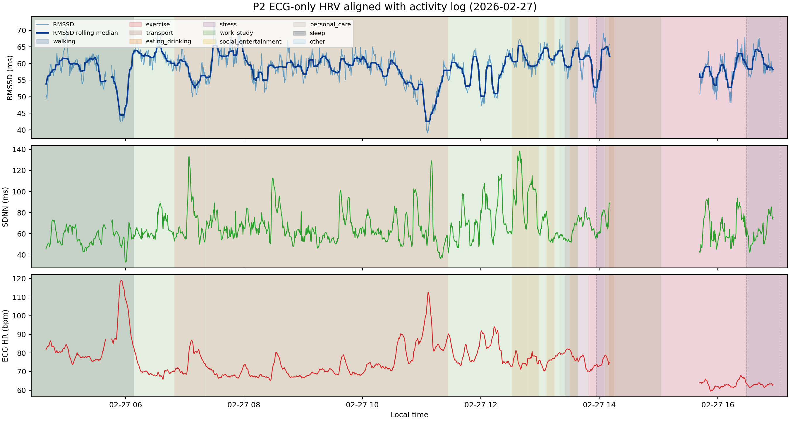

# P2 ECG-only HRV 与活动日志对齐案例分析（2026-02-27）

## 目的

使用 raw Polar ECG 单独计算 5 分钟 HRV 时间序列，再把 raw activity log 作为 sidecar annotation 对齐到每个窗口。本版本只要求 ECG label QC 通过，不要求 Earring/Ring/Watch 三设备 raw boundary aligned，也不要求 PPG sample coverage。

## 输入数据

- HRV 来源：`Multisite-PPG/raw_data` 中的 raw Polar ECG
- 活动日志来源：`Multisite-PPG/raw_data/P2/P2_activity_log.txt`
- 窗口设置：5 min window，stride 30 s
- ECG 保留条件：`ecg_label_qc_pass == True`

## 输出文件

- window-level sidecar CSV：`P2_2026-02-27_activity_hrv_ecg_only_stride30_window_aligned.csv`
- 可视化图：`P2_2026-02-27_activity_hrv_ecg_only_stride30_plot.png`

## 数据质量

- 当天 ECG-only 候选窗口数：2871
- ECG-QC 合格窗口数：1252 (43.6%)
- ECG-QC 不合格窗口数：1619
- ECG-QC 合格窗口中心时间范围：2026-02-27 04:39:30 到 2026-02-27 16:56:00
- 当天解析出的 activity interval 数：35
- HRV 覆盖时间内的 point/unpaired activity event 数：2
- 未匹配到 activity 的窗口比例：0.0%

这个 ECG-only 版本用于回答全天 ECG-derived HRV 与 activity log 的关系；它不适合直接作为 PPG model training dataset，因为没有要求三设备 PPG 同时可用。

## 单日 HRV 波动范围

- RMSSD 中位数/IQR：59.40 ms / 5.67 ms
- RMSSD 最小值/最大值：39.02 ms / 72.49 ms
- 相邻窗口之间最大的 RMSSD 变化：11.08 ms
- 约 30 分钟内最大的 RMSSD 变化：21.82 ms
- SDNN 中位数/IQR：62.60 ms / 16.94 ms
- ECG HR 中位数/IQR：73.53 bpm / 11.09 bpm

## 按活动类别汇总

| 活动类别 | 窗口数 | 重叠分钟数 | RMSSD中位数_ms | RMSSD_IQR_ms | SDNN中位数_ms | 心率中位数_bpm | motion中位数 |
| --- | --- | --- | --- | --- | --- | --- | --- |
| exercise | 652 | 3260.00 | 58.86 | 6.07 | 62.76 | 69.99 |  |
| work_study | 294 | 1470.00 | 60.59 | 4.87 | 64.00 | 75.46 |  |
| sleep | 155 | 775.00 | 58.16 | 5.94 | 55.05 | 80.64 |  |
| walking | 55 | 275.00 | 60.32 | 5.57 | 61.09 | 63.01 |  |
| eating_drinking | 46 | 230.00 | 60.74 | 4.64 | 101.83 | 76.91 |  |
| stress | 21 | 105.00 | 63.84 | 3.12 | 74.14 | 75.51 |  |
| symptom_fatigue | 20 | 100.00 | 59.37 | 2.76 | 54.34 | 81.15 |  |
| personal_care | 9 | 45.00 | 58.63 | 5.02 | 75.06 | 78.00 |  |

## 活动粗分类与具体事件对应表

下表列出 ECG-only HRV 覆盖时间范围内，脚本解析到的每个粗分类及其对应的原始 activity 文本。

| 粗分类 | 类型 | 具体事件原始文本 | 出现次数 | 覆盖分钟数 | 示例时间 |
| --- | --- | --- | --- | --- | --- |
| eating_drinking | interval | start drinking hot water 30s ago -> stop drinking water | 1 | 8.0 | 2026-02-27 13:30:04 -> 2026-02-27 13:38:05 |
| eating_drinking | interval | start drinking hot water about 3 mins ago -> stop drinking hot water | 1 | 7.9 | 2026-02-27 13:06:36 -> 2026-02-27 13:14:32 |
| eating_drinking | interval | start eating hot oatmeal spicy -> stop eating | 1 | 11.5 | 2026-02-27 12:46:55 -> 2026-02-27 12:58:26 |
| eating_drinking | interval | start making lunch -> stopped cooking | 1 | 15.3 | 2026-02-27 12:31:26 -> 2026-02-27 12:46:43 |
| eating_drinking | interval | started eating fruit 1 min ago -> stop eating fruit | 1 | 5.1 | 2026-02-27 14:09:40 -> 2026-02-27 14:14:45 |
| exercise | interval | start biking to class running late | 1 | 189.6 | 2026-02-27 13:48:53 -> 2026-02-27 20:03:11 |
| exercise | interval | start lifting things around -> stop lifting | 1 | 8.1 | 2026-02-27 07:12:37 -> 2026-02-27 07:20:41 |
| exercise | interval | start rowing soon -> stopped rowing 0845 | 1 | 245.8 | 2026-02-27 07:20:53 -> 2026-02-27 11:26:40 |
| exercise | interval | start running | 1 | 23.0 | 2026-02-27 06:49:37 -> 2026-02-27 07:12:37 |
| exercise | interval | started running 0850 -> stopped running around 0910 | 1 | 0.2 | 2026-02-27 11:26:50 -> 2026-02-27 11:27:02 |
| personal_care | interval | start change clothes to go to school -> stop getting dressed | 1 | 10.2 | 2026-02-27 13:38:31 -> 2026-02-27 13:48:44 |
| sleep | interval | start sleep -> stop sleep | 1 | 91.6 | 2026-02-27 00:28:40 -> 2026-02-27 06:08:35 |
| stress | interval | start doing work slightly stressed -> [unclosed] | 1 | 213.1 | 2026-02-27 13:25:25 -> 2026-02-27 17:25:25 |
| symptom_fatigue | interval | start feeling very tired -> stop feeling tired | 1 | 17.7 | 2026-02-27 13:20:27 -> 2026-02-27 13:38:11 |
| transport | point/unpaired | stop biking flat tire | 1 |  | 2026-02-27 13:56:54 |
| walking | interval | start walk -> stop walking | 1 | 8.2 | 2026-02-27 13:57:04 -> 2026-02-27 14:05:19 |
| walking | interval | start walking around to happy hour -> stop walking | 1 | 29.4 | 2026-02-27 16:29:06 -> 2026-02-27 18:44:50 |
| work_study | interval | start large meeting -> stop meeting | 1 | 57.1 | 2026-02-27 14:05:48 -> 2026-02-27 15:02:54 |
| work_study | interval | start lecture -> stop doing work | 1 | 541.3 | 2026-02-27 00:00:00 -> 2026-02-27 13:38:17 |
| work_study | point/unpaired | from 1530-1630 was in an advisor meeting | 1 |  | 2026-02-27 16:29:25 |

## 未匹配 Activity 的窗口

_没有未匹配 activity 的连续区间。_

## Point/Unpaired Activity Events

| 时间 | 类型 | 类别 | 原始文本 | 主要原因 |
| --- | --- | --- | --- | --- |
| 2026-02-27 13:56:54 | stop | transport | stop biking flat tire | 只有 stop 或 stop 无法和同类别 start 稳定配对 |
| 2026-02-27 16:29:25 | point | work_study | from 1530-1630 was in an advisor meeting | 单点状态/感受记录，不是明确 start-stop 活动区间 |

## 图像

图中相邻 HRV 点间隔超过 5 分钟时会自动断线，避免把缺失数据误画成长直线。

断线主要来自相邻 ECG-QC 合格窗口间隔过大，常见原因包括 raw ECG sample 不完整、R peak/IBI 质量不足，或 HRV 计算未通过 QC。

## 解读注意事项

- 这个版本只回答 ECG-derived HRV 的日内变化和 activity log 的对应关系。
- 与 raw-aligned training dataset 相比，它不会因为 Earring/Ring/Watch PPG 边界不齐而丢掉 ECG 可用窗口。
- activity category 来自自由文本规则归类，适合探索候选关系，不作为因果检验。
