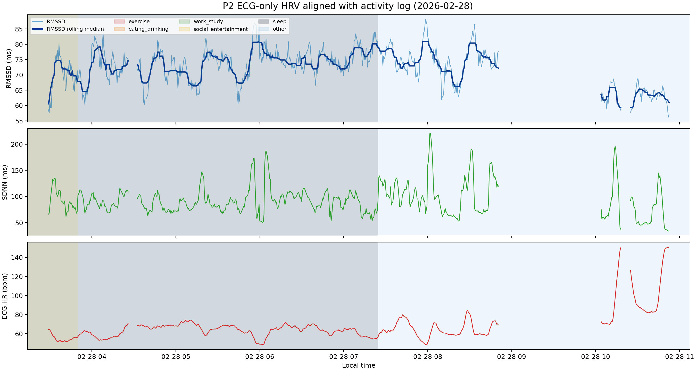

# P2 ECG-only HRV 与活动日志对齐案例分析（2026-02-28）

## 目的

使用 raw Polar ECG 单独计算 5 分钟 HRV 时间序列，再把 raw activity log 作为 sidecar annotation 对齐到每个窗口。本版本只要求 ECG label QC 通过，不要求 Earring/Ring/Watch 三设备 raw boundary aligned，也不要求 PPG sample coverage。

## 输入数据

- HRV 来源：`Multisite-PPG/raw_data` 中的 raw Polar ECG
- 活动日志来源：`Multisite-PPG/raw_data/P2/P2_activity_log.txt`
- 窗口设置：5 min window，stride 30 s
- ECG 保留条件：`ecg_label_qc_pass == True`

## 输出文件

- window-level sidecar CSV：`P2_2026-02-28_activity_hrv_ecg_only_stride30_window_aligned.csv`
- 可视化图：`P2_2026-02-28_activity_hrv_ecg_only_stride30_plot.png`

## 数据质量

- 当天 ECG-only 候选窗口数：2871
- ECG-QC 合格窗口数：683 (23.8%)
- ECG-QC 不合格窗口数：2188
- ECG-QC 合格窗口中心时间范围：2026-02-28 03:29:00 到 2026-02-28 10:52:30
- 当天解析出的 activity interval 数：13
- HRV 覆盖时间内的 point/unpaired activity event 数：0
- 未匹配到 activity 的窗口比例：0.0%

这个 ECG-only 版本用于回答全天 ECG-derived HRV 与 activity log 的关系；它不适合直接作为 PPG model training dataset，因为没有要求三设备 PPG 同时可用。

## 单日 HRV 波动范围

- RMSSD 中位数/IQR：73.14 ms / 8.12 ms
- RMSSD 最小值/最大值：56.21 ms / 88.09 ms
- 相邻窗口之间最大的 RMSSD 变化：16.75 ms
- 约 30 分钟内最大的 RMSSD 变化：27.14 ms
- SDNN 中位数/IQR：88.35 ms / 31.56 ms
- ECG HR 中位数/IQR：64.64 bpm / 9.95 bpm

## 按活动类别汇总

| 活动类别 | 窗口数 | 重叠分钟数 | RMSSD中位数_ms | RMSSD_IQR_ms | SDNN中位数_ms | 心率中位数_bpm | motion中位数 |
| --- | --- | --- | --- | --- | --- | --- | --- |
| sleep | 430 | 2150.00 | 73.64 | 5.96 | 88.52 | 64.19 |  |
| other | 253 | 1265.00 | 72.06 | 12.20 | 87.29 | 69.29 |  |

## 活动粗分类与具体事件对应表

下表列出 ECG-only HRV 覆盖时间范围内，脚本解析到的每个粗分类及其对应的原始 activity 文本。

| 粗分类 | 类型 | 具体事件原始文本 | 出现次数 | 覆盖分钟数 | 示例时间 |
| --- | --- | --- | --- | --- | --- |
| other | interval | started brushing teeth 2 mins ago | 1 | 448.5 | 2026-02-28 00:28:17 -> 2026-02-28 12:14:06 |
| sleep | interval | start sleep -> stop sleep | 1 | 237.7 | 2026-02-28 00:58:09 -> 2026-02-28 07:24:14 |
| social_entertainment | interval | start listening to o macklemore -> [unclosed] | 1 | 23.9 | 2026-02-28 00:00:00 -> 2026-02-28 03:50:25 |

## 未匹配 Activity 的窗口

_没有未匹配 activity 的连续区间。_

## Point/Unpaired Activity Events

_没有 point/unpaired activity event。_

## 图像

图中相邻 HRV 点间隔超过 5 分钟时会自动断线，避免把缺失数据误画成长直线。

断线主要来自相邻 ECG-QC 合格窗口间隔过大，常见原因包括 raw ECG sample 不完整、R peak/IBI 质量不足，或 HRV 计算未通过 QC。

## 解读注意事项

- 这个版本只回答 ECG-derived HRV 的日内变化和 activity log 的对应关系。
- 与 raw-aligned training dataset 相比，它不会因为 Earring/Ring/Watch PPG 边界不齐而丢掉 ECG 可用窗口。
- activity category 来自自由文本规则归类，适合探索候选关系，不作为因果检验。
